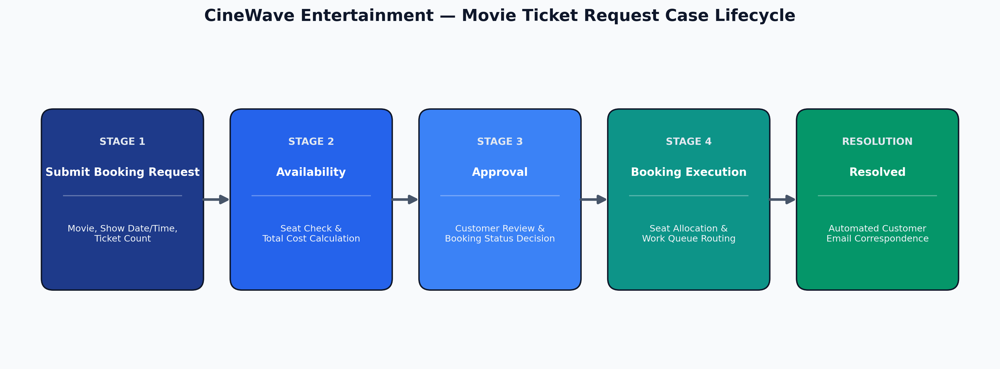

# CineWave Entertainment - Movie Ticket Request System

A case management application built on **Pega Platform** to govern movie ticket booking lifecycles, seat availability checks, cost calculations, customer confirmations, work queue routing, and automated correspondence notifications.

---

## 🎬 Architecture & Lifecycle



The `Movie Ticket Request` case type progresses through four primary stages and automated resolution:
1. **Submit Booking Request (Intake)**: Captures movie preferences and requested ticket quantity.
2. **Availability (Validation & Pricing)**: Verifies capacity and calculates `Total Cost`.
3. **Approval (Customer Confirmation)**: Displays structured review and captures `Booking Status`.
4. **Booking Execution (Fulfillment)**: Allocates seats, assigns Ticket ID, and routes by `Show Type`.
5. **Resolution**: Dispatches automated booking confirmation correspondence.

---

## 📑 Documentation Index

Detailed specifications are organized as PDF reports in the `docs/` directory:

| Document | Description | Format |
| :--- | :--- | :--- |
| **[User Stories](docs/user-stories.pdf)** | Detailed breakdown of user stories US-001 through US-010 with acceptance criteria. | PDF |
| **[Architecture & Lifecycle](docs/architecture-and-lifecycle.pdf)** | Stage-by-stage execution logic, decision paths, and state transitions. | PDF |
| **[Data Model](docs/data-model.pdf)** | Reusable data objects (`Movie`, `Show`) and case property dictionary. | PDF |
| **[Routing & SLA](docs/routing-and-sla.pdf)** | Goal/Deadline SLA urgency settings, work queue routing, and correspondence rules. | PDF |

---

## 📋 Summary of Implemented User Stories

| Story ID | Title | Scope & Artifacts | Status |
| :--- | :--- | :--- | :--- |
| **US-001** | Submit Movie Ticket Request | Case type creation, initial view, mandatory field validation, and data object linking. | Completed |
| **US-002** | Check Show Availability | Availability stage capacity verification via `Seat Availability Status` and `Available Seats Count`. | Completed |
| **US-003** | Calculate Booking Cost | Calculated property: `Total Cost = Ticket Price * Number of Tickets`. | Completed |
| **US-004** | Confirm Booking Request | Customer approval step capturing `Booking Status` decision (Confirmed vs. Cancelled). | Completed |
| **US-005** | Maintain Movie and Show Data | Reusable `Movie` and `Show` data objects referenced by the case type. | Completed |
| **US-006** | Review Booking Details | Summary review screen showing movie details, showtime, tickets, and total cost. | Completed |
| **US-007** | Process Ticket Booking | Seat allocation tracking: `Booking Confirmation Status`, `Seat Numbers`, and `Ticket ID`. | Completed |
| **US-008** | Notify Booking Confirmation | Automated email correspondence rule triggered on case resolution. | Completed |
| **US-009** | Define Booking SLA | Case SLA configured under Settings: Goal = 1 day, Deadline = 2 days. | Completed |
| **US-010** | Route Booking Request by Show Type | Automated routing to `PremiumShowQueue` or `StandardShowQueue` based on `Show Type`. | Completed |

---

## ⏱️ SLA Configuration

* **Goal**: `1 day` (Increases case urgency by `+10`)
* **Deadline**: `2 days` (Escalates priority and increases case urgency by `+20`)

---

## ✉️ Automated Correspondence Output

Dispatched upon case resolution to the Customer persona:

```text
Subject: Movie Ticket Booking Confirmed - [Case ID]

Dear [Customer Name],

Your movie ticket booking has been successfully confirmed.

Booking Details:
- Case ID: [Case ID]
- Movie Name: [Movie Name]
- Show Date & Time: [Show Date & Time]
- Number of Tickets: [Number of Tickets]
- Seat Numbers: [Seat Numbers]
- Total Cost: [Total Cost]

Please arrive at the theatre before show time and present your booking details at entry.

Thank you for choosing our services. Enjoy your movie!
— CineWave Entertainment Booking Support Team
